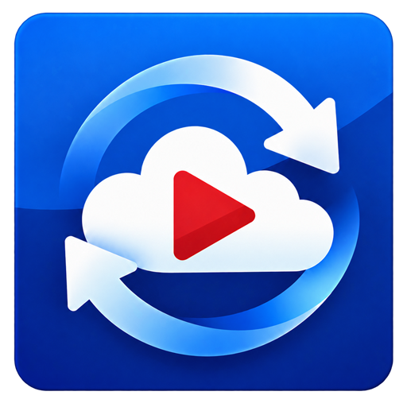

# SkyTubeMix
**A copylefted libre / open source YouTube player for Android, without ads.**

  

  <a href="#features">Features</a> | 
  <a href="#upstream-downloads">Upstream downloads</a> |
  <a href="#why-skytube">Why SkyTube?</a> | 
  <a href="#screenshots">Screenshots</a> | 
  <a href="#contribute">Contribute</a> | 
  <a href="#translate">Translate</a> | 
  <a href="#license">License</a>

## About this fork

SkyTubeMix is an independent fork of [SkyTube](https://github.com/SkyTubeTeam/SkyTube). It focuses on making SkyTube practical as a lightweight continuous-playback client, especially on older Android hardware, while preserving local subscriptions and account-free operation.

This fork is maintained by [ZeroIsOnFire](https://github.com/ZeroIsOnFire). Special thanks to the creators and contributors of the original SkyTube project, whose work made SkyTubeMix possible.

Changes introduced by this fork include:

* Mix-based continuous playback for standalone videos, enabled by default on fresh installs;
* previous/next controls for regular playlists and Mix sessions, including in-session back/forward history;
* selectable YouTube stream clients: VisionOS with Android fallback (default), VisionOS only, or the original Android-style client;
* a low-performance preset that selects lower-bandwidth playback defaults based on the device's physical display capability;
* the existing minimum/maximum range-based quality selection, with all individual quality controls remaining editable;
* continued support for Android 4.4 / API 19 and low-resource devices.

Continuous Mix playback and its previous/next controls are available only with the local ExoPlayer. Regular playlists continue independently of the Mix setting; for standalone videos, disabling Mix disables the next action while previously played items remain available through the session history. These features are not provided by the Legacy player, the official YouTube player, or Chromecast.

VisionOS generally provides direct stream links without an additional token, but YouTube may reject some kids content for that client. The default fallback mode automatically retries with the Android-style client when VisionOS extraction fails. The performance mode is a one-shot preset: later manual quality changes are preserved.

This project is not endorsed by the upstream SkyTube project. The original application description, attribution, download references, and GPL licensing information are retained below.

## Features
### Innovative Features
* Video blocker featuring:
  - Channel blacklisting
  - Channel whitelisting
  - Block videos if their language is not the same as the user's preferred one(s)
  - Block low-view videos
  - Block high-dislike videos
  - Toolbar icon showing number of blocked videos
* Watched or partially watched videos are marked accordingly. "Resume playing" feature also implemented
* Video swipe controls, including controls for volume, brightness, comments and video description
* Bookmark videos
* Import subscriptions from YouTube
* Play channels' playlists
* Download videos
* Ability to play the video faster — or slower than live. **[New!]**
* View and download video thumbnails
* No adverts when browsing or playing videos
* SponsorBlock to skip advertisement segments
* Back up and restore bookmarks and subscriptions (all stored locally on your device)

### Traditional Features
* Explore Featured and Most Popular videos
* Browse YouTube channels
* Play YouTube videos
* View video comments
* Search videos, music and channels
* Channel subscription & non-intrusive notifications
* Subscriptions feed

More features will be added in the near future.

## Requirements
Android 4.4 (KitKat) or later. For techies, that means an API level of 19 or greater.
If you have older Android device - however, at least 4.0, you should try [SkyTube Legacy](https://github.com/SkyTubeTeam/SkyTubeLegacy/).

## Upstream downloads

The links in this table point to releases maintained by the upstream SkyTube project, not to SkyTubeMix builds.

| Feature          | SkyTube Extra                      | SkyTube  |
| ---------------- |------------------------------------| ---------|
| Description      | Contains extra features that are powered by non-OSS libraries. | Fully open-source and free software. |
| GPLv3 license                    | ✅                   | ✅       |
| Official YouTube player support* | ✅                   | ❌       |
| Chromecast Support*              | ✅                   | ❌       |
| Updates availability             | Immediate            | Normally up to 5 days |
| Download APK                     |  | 

_* powered by a closed-source, third-party library._

## Why SkyTube?
* Copylefted libre software
* Gratis
* Innovative design
* No ads
* Multilingual
* Not dependent on GApps/Google Apps (the official YouTube app)
* No need for Google/YouTube account to operate
* Does not spy on your behaviour!

## Translate
You can help us translate this app into your native language by visiting [SkyTube's Weblate page](https://hosted.weblate.org/engage/skytube/). Just log in using your GitHub/GitLab/BitBucket/Google/Facebook account and start translating!

### Translation status:

## Screenshots
### Phone

### Tablet

## Contribute
This project was possible with the support and contribution of [numerous volunteers and third-party projects](http://skytube-app.com/credits.html).

Help improve SkyTube by [translating](https://github.com/SkyTubeTeam/SkyTube/wiki/Contribute#translate) or [developing](https://github.com/SkyTubeTeam/SkyTube/wiki/Contribute#developers-guidelines) it.

## License

This project is not affiliated with YouTube™ or any of its partners and/or products.
YouTube™ and Android™ are registered trademarks of Google Inc.

## Star History

